# LoveSports!

Developed by Gethin Davies

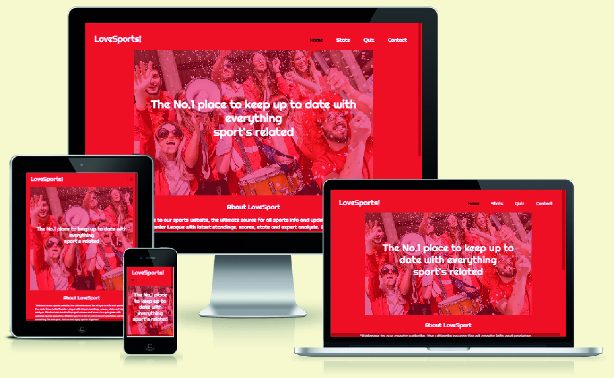

LoveSports! is a sports website that let's the user's keep up to date with the latest premier league standings, Top Goal Scorers of the league. It also includes a quiz for the sports fans out there. 

[Live Website](https://gethindavies1990.github.io/CI_MS2_DTR/)

## Table of Content

1. [Project Goals](#project-goals)
    1. [User Goals](#user-goals)
    2. [Site Owner Goals](#site-owner-goals)
2. [User Experience](#user-experience)
    1. [Target Audience](#target-audience)
    2. [User Requirements and Expectations](#user-requirements-and-expectations)
    3. [User Stories](#user-stories)
3. [Design](#design)
    1. [Design Choices](#design-choices)
    2. [Color](#colours)
    3. [Fonts](#fonts)
    4. [Structure](#structure)
    5. [Wireframes](#wireframes)
4. [Technologies Used](#technologies-used)
    1. [Languages](#languages)
    2. [Frameworks & Tools](#frameworks-&-tools)
5. [Features](#features)
6. [Testing](#validation)
    1. [HTML Validation](#HTML-validation)
    2. [CSS Validation](#CSS-validation)
    3. [Accessibility](#accessibility)
    4. [Performance](#performance)
    5. [Device testing](#performing-tests-on-various-devices)
    6. [Browser compatibility](#browser-compatibility)
    7. [Testing user stories](#testing-user-stories)
8. [Bugs](#Bugs)
9. [Deployment](#deployment)
10. [Credits](#credits)
11. [Acknowledgements](#acknowledgements)

## Project Goals 

### User Goals
- Finding the latest premier league standings
- Finding the current top goal scorer in the league
- Taking part in the LoveSports! quiz game
- Contacting the owners of the website

### Site Owner Goals
- Increase web visitors to the site
- Promote the business
- Give users the chance to partake in the interactive quiz
- Show the users the latest premier league standings
- Show the user the latest Top goal scorers of the premier league

## User Experience

### Target Audience
- Football Fans
- Premier League football fans
- Sports Fans

### User Requirements and Expectations

- A simple and intuitive navigation system
- Quickly and easily find relevant information
- Links and functions that work as expected
- Good presentation and a visually appealing design regardless of screen size
- An easy way to contact the owners of the website
- Simple content that the user can skim read
- Accessibility

### User Stories

#### First-time User 
1. As a first time user, I want to find out the latest premier league standings
2. As a first time user, I want to find out the latest premier top goal scorer's
3. As a first time user, I want to know more information about the website
4. As a first time user, I want to be able to contact the webiste owner
5. As a first time user, I want to be able to particpate in the interactive quiz game
6. As a first time user, I want to be able to find the social media sites
7. As a first time user, I want to be able to subscribe to the websites newsletter

#### Returning User
8. As a returning user, I want to find out the latest premier league standings
9. As a returning user, I want to find out the latest premier top goal scorer's
10. As a returning user, I want to know more information about the website
11. As a returning user, I want to be able to contact the webiste owner
12. As a returning user, I want to be able to particpate in the interactive quiz game
13. As a returning user, I want to be able to find the social media sites
14. As a returning user, I want to be able to subscribe to the websites newsletter

#### Site Owner 
15. As the site owner, I want the users to keep up to date with the latest premier league standings
16. As the site owner, I want the users to find out the latest top goal scorer table
17. As the site owner, I want the users to be able to contact us
18. As the site owner, I want the users to play the interactive quiz game
19. As the site owner, I want the users be able to find the social media sites
20. As a returning user, I want to be able to subscribe to the websites newsletter

## Design

### Design Choices
The webpage was designed to be easy to navigate and eye catching with a nice contrast of colors to appeal to the customer, it was made to be fully responsive on all devices. 

### Colour
I wanted to use bright colours for the design, to attract the customer to the website. the colour chosen for the main background and the majority of the websote was #DB2929.
White #ffffff was then used for the text accorss all part of the website and also black #111111 where a white background was used/
 

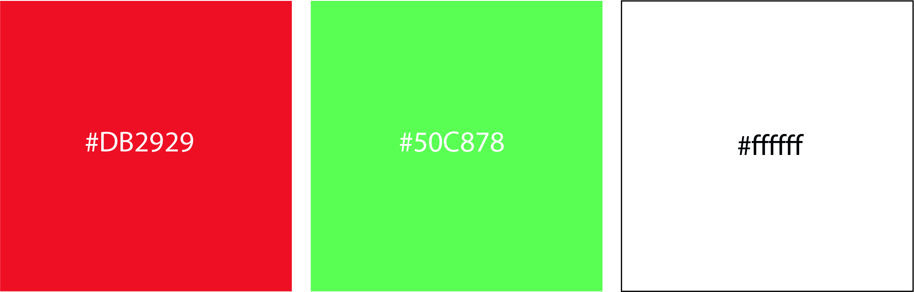

### Fonts
Righteous, which is a google font was used for all text elements of the website.
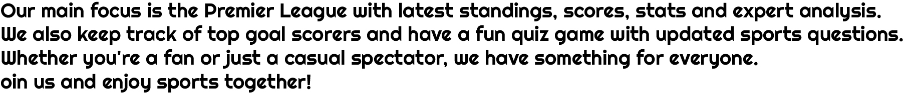

### Logo

The logo was made from the font-family Righteous and the words 'Love Sports!' was concanated

### Structure

The page is structured to be user friendly and only has 4 pages, The Homepage, The Football Stats Page, The quiz page and the Contact page 
- The index page includes a hero section with a typed animation which overlays the image
- An about section is present in the page, which describes a small brief on the websites features
- The footer section includes the social media links, on the index.html page it also includes a subscribe email submit form. 
- The football stats page includes 2 table which display the live current football standings and also the top goal scorer tally of the premier league. 
- The quiz page includes a quiz rules dropdown box to list the user with the rules to play the quiz
- The conatct page includes a form to submit to get in touch with the site owner

### Wireframes

#### Desktop

Hero

Testimonial

Our Story

Contact

Footer

Error 404

Book Table

#### Mobile

Mobile

404

Book Table

#### Tablet

Tablet

404

Book Table

## Technologies Used

### Languages
- HTML
- CSS
- JavaScript

### Frameworks & Tools
- Bootstrap v5.2.1
- Git
- GitHub
- Gitpod
- Adobe Illustrator
- Figma
- Google Fonts
- Font Awsome
- Sweet Alerts
- Jquery
- Emailjs
- Favicon.io

## Features
The site consists of 4 pages and fourteen features

### Navigation Bar
- Featured on all four pages
- The navbar is fully responsive and changes to a toggler (hamburger menu) on smaller screens and includes links to the Homepage, football stats page, quiz page and the contact page.
- It allows users to easily navigate the page
- The link for the page the user is currently on is highlighted in black, when the user scrolls over the other links the text will change color to highlight it is a clickable element.

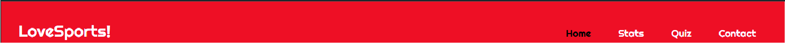

### Hero
- Introduces the user the website with a typing animation (made with jquery plugin)
- User Stories covered: 3, 9 

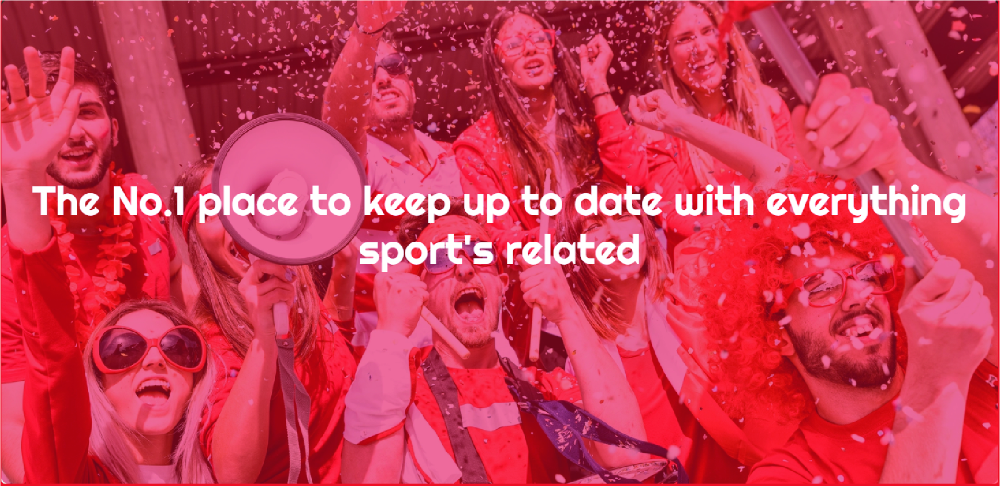

### About
- The user instantly is introduced to a short breif on the website and its purpose
- User Stories covered: 3, 9

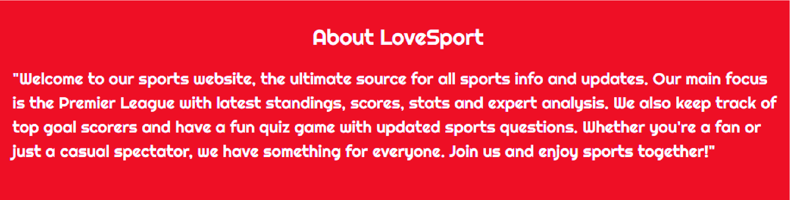

### Social Links
- Allows users to see how the tap room was established and the growth it has undertaken up to the current year
- User Stories covered: 6, 12, 17

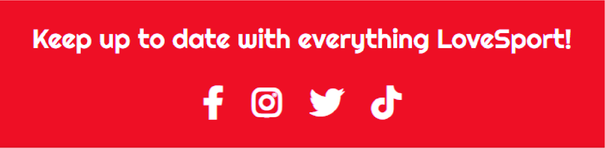

### Newsletter
- Allows users to subscribe to the newsletter and get added to the mailing list
- User Stories covered: 7, 14, 20

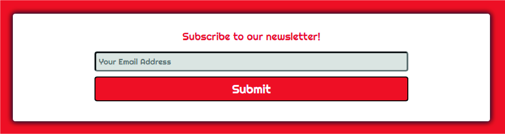

### Premier League Standings API
- Gives the user a the live up to date Premier league standings
- Displays all 20 teams and their positions in the league
- Displays the team's logo's
- Displays the team's current Win,Loss,Draw tally
- Displays the team's Goals For (GF), Goals Against (GA), Goals Difference (GD)
- Displays the tema's 'Last 5' Results - Win(W), Loss(L), Draw(D)
- User Stories covered: 1, 8, 15

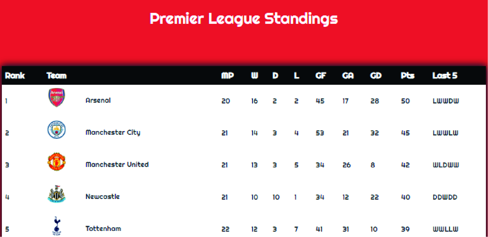

### Premier League Top Goal Scorer's API
- Gives the user a live up to date table of the top 20 goal scorer's in the premier league
- Displays all 20 players with thier profile picture
- Display's the Players Team logo
- The players goal tally
- Displays the players assist tally if any
- User stories covered: 2, 9, 16

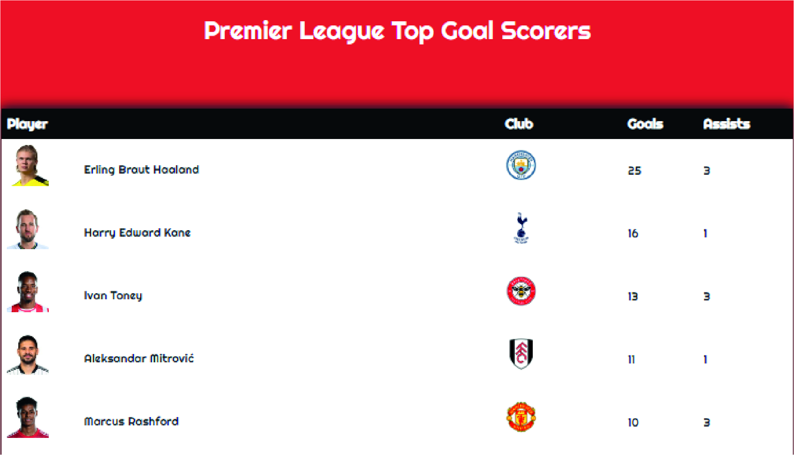

### Quiz Rules
- Displays to the user the rules for the quiz
- Was made with a dropdown animation using jquery
- Once the 'Start Quiz' Button is clicked this element will be hidden

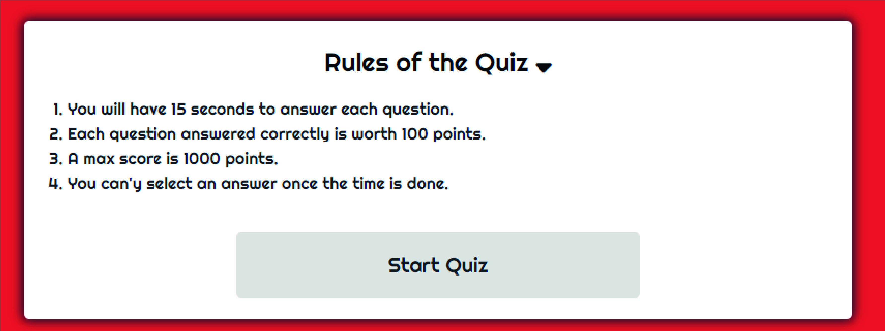

### Quiz Features
- The quiz features a timer that countsdown from 15 seconds to 0
- Once the timer is finished, the user cannot select an answer
- Each question is shuffled so the all user's do not have the same question each time
- There is 10 questions to be answered
- 1000 points is the max score the user can achieve
- 100 points is awarded for every correct answer and will be added to the score tally in the top left corner
- A correct answer will add the 'correct' class to elements and make these green so the user is visually aware they got the answer correct
- A correct answer will also give feedback of 'Well Done! That is Correct!'
- The correct Answer selected will also display green, and all other inccorect answers will be displayed in red
- A incorrect answer will add the 'wrong' class to elements and highlight them red
- A incorrect answer will also generate the feedback to notify the user the answer was incorrect 'Ahhh that is Wrong!'
- A incorrect answer, will also highlight what the crrect answer was to the user so they are aware
- On completion of the quiz, the user will be alerted with their score, the alert used was by the library 'sweet alerts'

Correct Answer

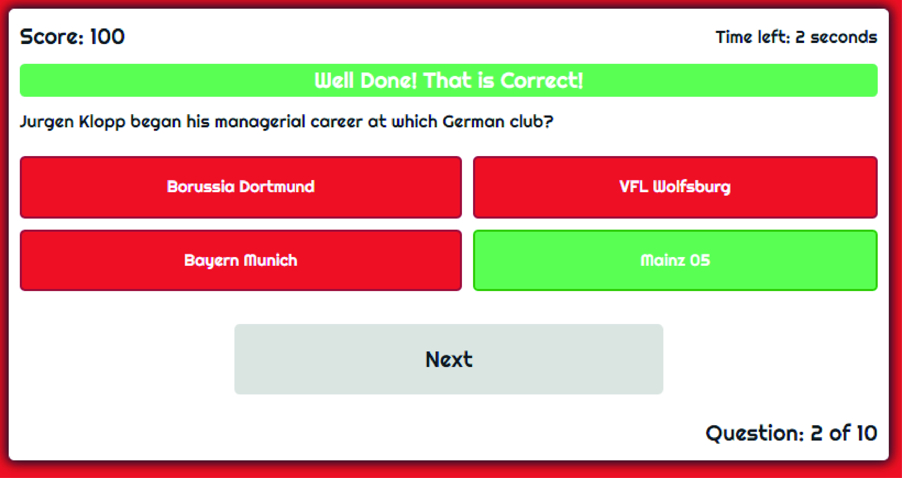

Incorrect Answer

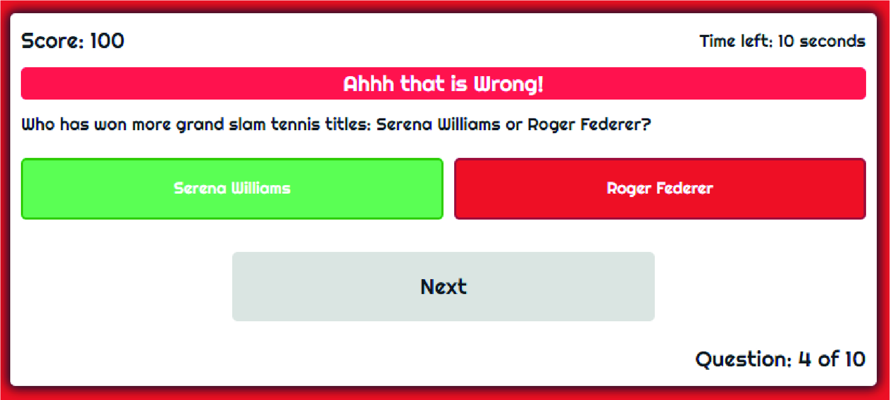

Quiz Completion

### Feedback Form
- Gives the user a form to submit a feedback message
- Emailjs was used
- Some field validation was used, and I combined it with the sweet alert library to alert the user if the submission of the form was succesful or if it was unsuccessful
- User Stories covered: 4, 11, 17

Sucessful Submission

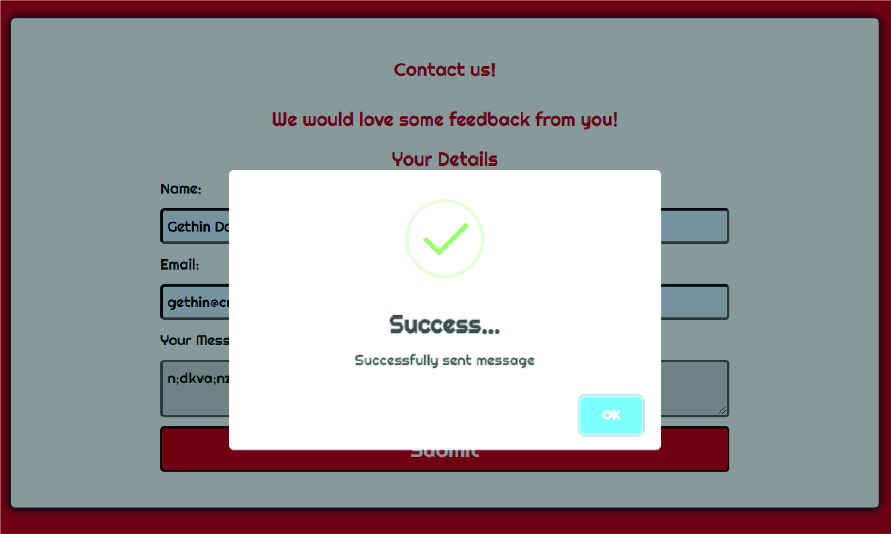

Uncsuccessful Submission

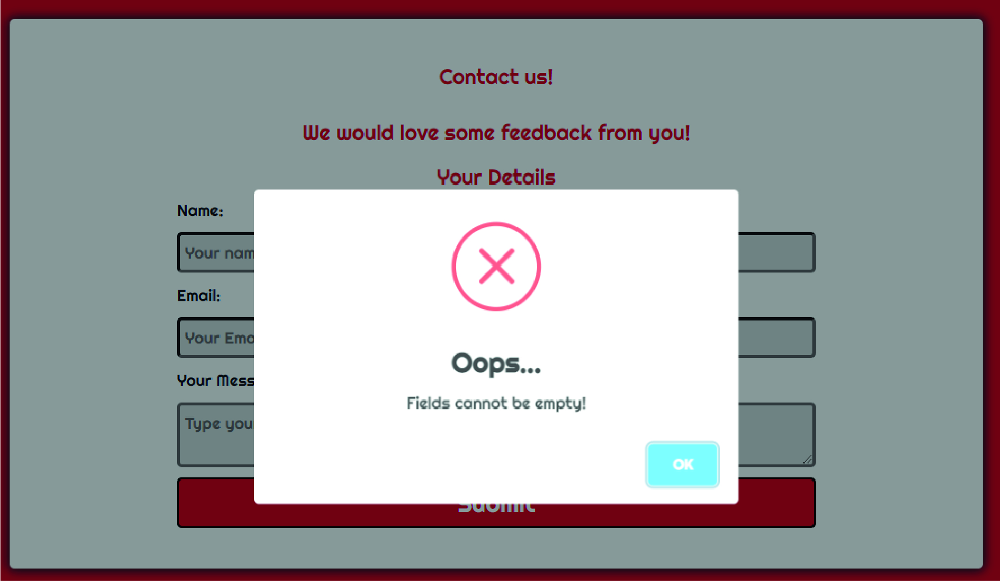

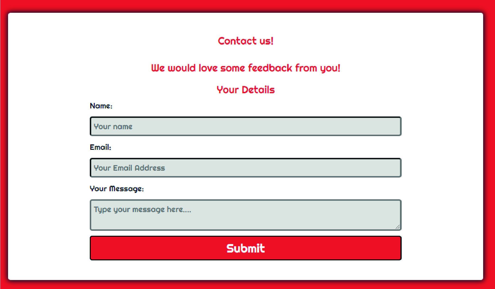

## Validation

### HTML Validation
The W3C Markup Validation Service was used to validate the HTML of the website. All pages pass with no errors no warnings to show.

Home/Index

Book Table

404

### CSS Validation
The W3C Jigsaw CSS Validation Service was used to validate the CSS of the website.
When validating the page as a whole, the validator shows some errors linked to Bootstrap v5.1.2. When validating just my own custom CSS it passes with no errors found.

style.css

### Accessibility
The WAVE WebAIM web accessibility evaluation tool was used to ensure the website met high accessibility standards. All pages pass with 0 alerts, some pages had a few contrast errors for the text that overlays the images.

Home

Book Table

404

### Performance 
Google Lighthouse in Google Chrome Developer Tools was used to test the performance of the website. 

Home

Book Table

404

### Performing tests on various devices 
The website was tested on the following devices:
- Fujitsu Laptop (both in pc and tablet mode)
- Windows Asus
- Apple Iphone 8
- Apple Iphone 13

In addition, the website was tested using Google Chrome Developer Tools Device Toggling option for all available device options.

### Browser compatibility
The website was tested on the following browsers:
- Google Chrome
- Mozilla Firefox
- Microsoft Edge

### Testing user stories

## First-time User 

1. As a first time user, I want to know where the taproom is located

| **Feature** | **Action** | **Expected Result** | **Actual Result** |
|-------------|------------|---------------------|-------------------|
| Map | Navigate to the how to find us section, locate the Google Map | Locating a map showing the location of the taproom | Works as expected |

Screenshot

2. As a first time user, I want to know how to get in contact with the tap room

| **Feature** | **Action** | **Expected Result** | **Actual Result** |
|-------------|------------|---------------------|-------------------|
| Contact information | Navigate to the how to find us section, locate the contact information | Locate the contact section to find relevant information | Works as expected |

Screenshot

3. As a first time user, I want to know more about about the taproom

| **Feature** | **Action** | **Expected Result** | **Actual Result** |
|-------------|------------|---------------------|-------------------|
| Our Story Section | Navigate to the Our story section, | User has an introduction to how the tap room was established | Works as expected |

Screenshot

4. As a first time user, I want to find out what events they have on

| **Feature** | **Action** | **Expected Result** | **Actual Result** |
|-------------|------------|---------------------|-------------------|
| Event Section | Navigate to the event section, | User has an overview of all the events running that week | Works as expected |

Screenshot

## Returning User
5. As a returning user, I want to find a phone number to call to book a table
   
| **Feature** | **Action** | **Expected Result** | **Actual Result** |
|-------------|------------|---------------------|-------------------|
| Contact information | Navigate to the how to find us section, locate the contact information | Locate the contact section to find relevant information | Works as expected |

Screenshot

6. As a returning user, I want to what events they have on

 | **Feature** | **Action** | **Expected Result** | **Actual Result** |
|-------------|------------|---------------------|-------------------|
| Event Section | Navigate to the event section, | User has an overview of all the events running that week | Works as expected |

Screenshot

7. As a returning user, I want know what the brew of the week is

| **Feature** | **Action** | **Expected Result** | **Actual Result** |
|-------------|------------|---------------------|-------------------|
| Event Section | Navigate to the event section, | User has an overview of what the brew of the week will be | Works as expected |

Screenshot

8. As a returning user, I want to find the tap room social handles

| **Feature** | **Action** | **Expected Result** | **Actual Result** |
|-------------|------------|---------------------|-------------------|
| Footer Section | Navigate to the footer section, | User has access to all the social handles of the business | Works as expected |

Screenshot

9. As a returning user, I want to get directions to the tap room

| **Feature** | **Action** | **Expected Result** | **Actual Result** |
|-------------|------------|---------------------|-------------------|
| Map | Navigate to the how to find us section, locate the Google Map | Locating a map showing the location of the taproom | Works as expected |

Screenshot

 As a  user, I may navigate to a 404 page

| **Feature** | **Action** | **Expected Result** | **Actual Result** |
|-------------|------------|---------------------|-------------------|
| error 404 | User navigates to a 404 page | lands on 404 page and has the option to go back to the homepage | Works as expected |

Screenshot

## Bugs

| **Bug** | **Fix** |
| ----------- | ----------- |
| White Space was showing on the event section  | Added margin 0 to the div of the event section removed this |
| Content overflow into different sections on mobile | Added min-height to sections to allow the section to grow with content on mobile |
| Contrast issues with all images that has a text overlay | Added a opaque overlay to all images |
| Bootstrap fixed-top nav bar was overlapping some content on pages | Set the body to have padding-top of 50px |

## Deployment
The website was deployed using GitHub Pages by following these steps:
1. In the GitHub repository navigate to the Settings tab
2. On the left hand menu select Pages
3. For the source select Branch: master
4. After the webpage refreshes automatically you will se a ribbon on the top saying: "Your site is published at https://gethindavies1990.github.io/CI_MS1_DTR/index.html

You can for fork the repository by following these steps:
1. Go to the GitHub repository
2. Click on Fork button in upper right hand corner

You can clone the repository by following these steps:
1. Go to the GitHub repository 
2. Locate the Code button above the list of files and click it 
3. Select if you prefer to clone using HTTPS, SSH, or Github CLI and click the copy button to copy the URL to your clipboard
4. Open Git Bash
5. Change the current working directory to the one where you want the cloned directory
6. Type git clone and paste the URL from the clipboard ($ git clone https://github.com/YOUR-USERNAME/YOUR-REPOSITORY)
7.Press Enter to create your local clone.

## Credits
Images not referenced below are owned by the developer.

### Images
 * [hero image](assets/images/beer-hero.webp): downloaded from <a href="https://elements.envato.com/cheering-up-with-beer-W2GULE9">Envato</a>
* [Testimonial image 1](assets/images/testimonial-1.webp): downloaded from <a href="https://elements.envato.com/elegant-confident-afro-american-businessman-in-gla-3MM44SJ">Envato</a>
* [Testimonial image 2](assets/images/testimonial-2.webp): downloaded from <a href="https://elements.envato.com/portrait-of-a-beautiful-happy-young-woman-headshot-GX3QC6N">Envato</a>
* [Our Story Carousel 1](assets/images/home-brewery.webp): downloaded from <a href="https://elements.envato.com/home-brew-74D8PZC">Envato</a>
* [Our Story Carousel 2](assets/images/warehouse.webp): downloaded from <a href="https://elements.envato.com/empty-warehouse-74D8PZC">Envato</a>
* [Our Story Carousel 3](assets/images/taproom.webp): downloaded from <a href="https://elements.envato.com/bar-pub">Envato</a>
* [Event img 1](assets/images/beer-pour.webp): downloaded from <a href="https://elements.envato.com/side-view-of-mans-hands-that-fills-glasses-by-beer-9WWBNZZ">Envato</a>
* [Event img 2](assets/images/beer-of-week.webp): downloaded from <a href="https://elements.envato.com/pale-beer-N4RX5NF">Envato</a>
* [Event img 3](assets/images/comedy-night.webp): downloaded from <a href="https://elements.envato.com/friends-laughing-and-drinking-draft-beer-CDXETQA">Envato</a>
* [Event img 4](assets/images/rocker.webp): downloaded from <a href="https://elements.envato.com/male-singer-in-sunglasses-rock-band-TYEQBLN">Envato</a>
* [Event img 5](assets/images/taco-tuesday.webp): downloaded from <a href="https://elements.envato.com/tacos-EUP92L7">Envato</a>

### Code
* Bootstrap was used in many areas of the website to make it responsive.
* grid image system by Dcode on youtube
* The contact/Map section a flex video was watched to understand how it works to implement this https://www.youtube.com/watch?v=JJSoEo8JSnc

All imagery was taken from  Envato Elements(https://elements.envato.com/) and is credited in my code.

[Back to Table Of Content](#Table-of-Content)

## Acknowledgements
I would like to take the opportunity to thank:
- My mentor Mo Shami for his feedback, advice, guidance and support.
- My Wife for her continued support and giving me the time to do this project
- My Parents for testing out the website when I asked of them