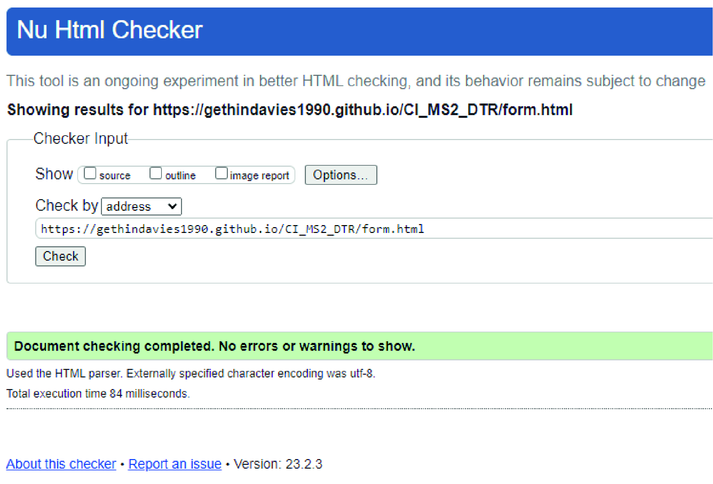
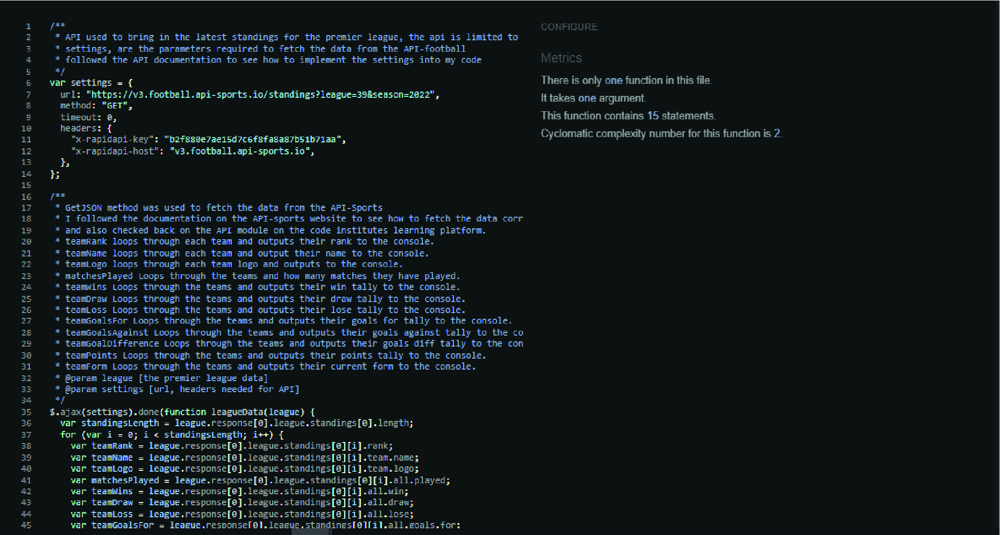

# LoveSports!

Developed by Gethin Davies

LoveSports! is a sports website that let's the user's keep up to date with the latest premier league standings, Top Goal Scorers of the league. It also includes a quiz for the sports fans out there. 

[Live Website](https://gethindavies1990.github.io/CI_MS2_DTR/)

## Table of Content

1. [Project Goals](#project-goals)
    1. [User Goals](#user-goals)
    2. [Site Owner Goals](#site-owner-goals)
2. [User Experience](#user-experience)
    1. [Target Audience](#target-audience)
    2. [User Requirements and Expectations](#user-requirements-and-expectations)
    3. [User Stories](#user-stories)
3. [Design](#design)
    1. [Design Choices](#design-choices)
    2. [Color](#colours)
    3. [Fonts](#fonts)
    4. [Structure](#structure)
    5. [Wireframes](#wireframes)
4. [Technologies Used](#technologies-used)
    1. [Languages](#languages)
    2. [Frameworks & Tools](#frameworks-&-tools)
5. [Features](#features)
6. [Testing](#validation)
    1. [HTML Validation](#HTML-validation)
    2. [CSS Validation](#CSS-validation)
    3. [Accessibility](#accessibility)
    4.[Javascirpt Validation](#javascript-validation)
    5. [Performance](#performance)
    6. [Device testing](#performing-tests-on-various-devices)
    7. [Browser compatibility](#browser-compatibility)
    8. [Testing user stories](#testing-user-stories)
8. [Bugs](#Bugs)
9. [Deployment](#deployment)
10. [Credits](#credits)
11. [Acknowledgements](#acknowledgements)

## Project Goals 

### User Goals
- Finding the latest premier league standings
- Finding the current top goal scorer in the league
- Taking part in the LoveSports! quiz game
- Contacting the owners of the website

### Site Owner Goals
- Increase web visitors to the site
- Promote the business
- Give users the chance to partake in the interactive quiz
- Show the users the latest premier league standings
- Show the user the latest Top goal scorers of the premier league

## User Experience

### Target Audience
- Football Fans
- Premier League football fans
- Sports Fans

### User Requirements and Expectations

- A simple and intuitive navigation system
- Quickly and easily find relevant information
- Links and functions that work as expected
- Good presentation and a visually appealing design regardless of screen size
- An easy way to contact the owners of the website
- Simple content that the user can skim read
- Accessibility

### User Stories

#### First-time User 
1. As a first time user, I want to find out the latest premier league standings
2. As a first time user, I want to find out the latest premier top goal scorer's
3. As a first time user, I want to know more information about the website
4. As a first time user, I want to be able to contact the webiste owner
5. As a first time user, I want to be able to particpate in the interactive quiz game
6. As a first time user, I want to be able to find the social media sites
7. As a first time user, I want to be able to subscribe to the websites newsletter

#### Returning User
8. As a returning user, I want to find out the latest premier league standings
9. As a returning user, I want to find out the latest premier top goal scorer's
10. As a returning user, I want to know more information about the website
11. As a returning user, I want to be able to contact the webiste owner
12. As a returning user, I want to be able to particpate in the interactive quiz game
13. As a returning user, I want to be able to find the social media sites
14. As a returning user, I want to be able to subscribe to the websites newsletter

#### Site Owner 
15. As the site owner, I want the users to keep up to date with the latest premier league standings
16. As the site owner, I want the users to find out the latest top goal scorer table
17. As the site owner, I want the users to find out more information on the site
18. As the site owner, I want the users to be able to contact us
19. As the site owner, I want the users to play the interactive quiz game
20. As the site owner, I want the users be able to find the social media sites
21. As a returning user, I want to be able to subscribe to the websites newsletter

## Design

### Design Choices
The webpage was designed to be easy to navigate and eye catching with a nice contrast of colors to appeal to the customer, it was made to be fully responsive on all devices. 

### Colour
I wanted to use bright colours for the design, to attract the customer to the website. the colour chosen for the main background and the majority of the websote was #DB2929.
White #ffffff was then used for the text accorss all part of the website and also black #111111 where a white background was used. #50C878 was used mostly in the quiz game of the website, to give positive feedback on correct answers. 
 

### Fonts
Righteous, which is a google font was used for all text elements of the website.

### Logo

The logo was made from the font-family Righteous and the words 'Love Sports!' was concanated

### Structure

The page is structured to be user friendly and only has 4 pages, The Homepage, The Football Stats Page, The quiz page and the Contact page 
- The index page includes a hero section with a typed animation which overlays the image
- An about section is present in the page, which describes a small brief on the websites features
- The footer section includes the social media links, on the index.html page it also includes a subscribe email submit form. 
- The football stats page includes 2 table which display the live current football standings and also the top goal scorer tally of the premier league. 
- The quiz page includes a quiz rules dropdown box to list the user with the rules to play the quiz
- The contact page includes a form to submit to get in touch with the site owner

### Wireframes

I made the wireframes using figma, I made every effort to stick to this deisgn plan with only subtle changes made in the finsished project

#### Desktop

 

Index

Football Stats

Quiz

Contact

Error 404

 

#### Mobile

 

Index

Football Stats

Quiz

Contact

Error 404

 

#### Tablet

 

Index

Football Stats

Quiz

Contact

Error 404

 

#### Technologies Used

### Languages
- HTML
- CSS
- JavaScript

### Frameworks & Tools
- Bootstrap v5.2.1
- Git
- GitHub
- Gitpod
- Adobe Illustrator
- Figma
- Google Fonts
- Font Awsome
- Sweet Alerts
- Jquery
- Emailjs
- Favicon.io

## Features
The site consists of 4 pages and 9 features

### Navigation Bar
- Featured on all four pages
- The navbar is fully responsive and changes to a toggler (hamburger menu) on smaller screens and includes links to the Homepage, football stats page, quiz page and the contact page.
- It allows users to easily navigate the page
- The link for the page the user is currently on is highlighted in black, when the user scrolls over the other links the text will change color to highlight it is a clickable element.

### Hero
- Introduces the user the website with a typing animation (made with jquery plugin)
- User Stories covered: 3, 9 

### About
- The user instantly is introduced to a short breif on the website and its purpose
- User Stories covered: 3, 9

### Social Links
- Allows users to see how the tap room was established and the growth it has undertaken up to the current year
- User Stories covered: 6, 12, 17

### Newsletter
- Allows users to subscribe to the newsletter and get added to the mailing list
- User Stories covered: 7, 14, 20

### Premier League Standings API
- Gives the user a the live up to date Premier league standings
- Displays all 20 teams and their positions in the league
- Displays the team's logo's
- Displays the team's current Win,Loss,Draw tally
- Displays the team's Goals For (GF), Goals Against (GA), Goals Difference (GD)
- Displays the tema's 'Last 5' Results - Win(W), Loss(L), Draw(D)
- User Stories covered: 1, 8, 15

### Premier League Top Goal Scorer's API
- Gives the user a live up to date table of the top 20 goal scorer's in the premier league
- Displays all 20 players with thier profile picture
- Display's the Players Team logo
- The players goal tally
- Displays the players assist tally if any
- User stories covered: 2, 9, 16

### Quiz Rules
- Displays to the user the rules for the quiz
- Was made with a dropdown animation using jquery
- Once the 'Start Quiz' Button is clicked this element will be hidden

### Quiz Features
- The quiz features a timer that countsdown from 15 seconds to 0
- Once the timer is finished, the user cannot select an answer
- Each question is shuffled so the all user's do not have the same question each time
- There is 10 questions to be answered
- 1000 points is the max score the user can achieve
- 100 points is awarded for every correct answer and will be added to the score tally in the top left corner
- A correct answer will add the 'correct' class to elements and make these green so the user is visually aware they got the answer correct
- A correct answer will also give feedback of 'Well Done! That is Correct!'
- The correct Answer selected will also display green, and all other inccorect answers will be displayed in red
- A incorrect answer will add the 'wrong' class to elements and highlight them red
- A incorrect answer will also generate the feedback to notify the user the answer was incorrect 'Ahhh that is Wrong!'
- A incorrect answer, will also highlight what the crrect answer was to the user so they are aware
- On completion of the quiz, the user will be alerted with their score, the alert used was by the library 'sweet alerts'

Correct Answer

Incorrect Answer

Quiz Completion

### Feedback Form
- Gives the user a form to submit a feedback message
- Emailjs was used
- Some field validation was used, and I combined it with the sweet alert library to alert the user if the submission of the form was succesful or if it was unsuccessful
- User Stories covered: 4, 11, 17

Sucessful Submission

Uncsuccessful Submission

## Validation

### HTML Validation
The W3C Markup Validation Service was used to validate the HTML of the website. All pages pass with no errors no warnings to show.

Home/Index

Football Stats

Contact

Quiz

### CSS Validation
The W3C Jigsaw CSS Validation Service was used to validate the CSS of the website. All passes with no errors.

style.css

### Accessibility
The WAVE WebAIM web accessibility evaluation tool was used to ensure the website met high accessibility standards. All pages pass with 0 alerts.

Home

Contact

Football Stats

Quiz

### JavaScript Validation
The JSHint code quality test, showed a few unused variables, this is because they were in external folders, or being used by cdn's, after a lot of googling it looks like it should be put in the top of each file as a global variable comment. this is evident in a few of the js hint screenshots and folders, once this was done all JS folders pass.

Form

Jquery

League Standings

Quiz

Subscribe

Top Goal Scorer

### Performance 
Google Lighthouse in Google Chrome Developer Tools was used to test the performance of the website. 

Home

Football Stats

Contact

Quiz

### Performing tests on various devices 
The website was tested on the following devices:
- Fujitsu Laptop (both in pc and tablet mode)
- Windows Asus
- Apple Iphone 8
- Apple Iphone 13
- Wide desktop Monitor

In addition, the website was tested using Google Chrome Developer Tools Device Toggling option for all available device options.

### Browser compatibility
The website was tested on the following browsers:
- Google Chrome
- Mozilla Firefox
- Microsoft Edge

### Testing user stories

## First-time User 
 

1. As a first time user, I want to find out the latest premier league standings

| **Feature** | **Action** | **Expected Result** | **Actual Result** |
|-------------|------------|---------------------|-------------------|
| Premier League Standings | Navigate to the 'stats' link in navbar, locate the Premier league standing table | Locating the table will show the up to date premier league standing's table | Works as expected |

Screenshot

 

2. As a first time user, I want to find out the latest premier league top scorer's

| **Feature** | **Action** | **Expected Result** | **Actual Result** |
|-------------|------------|---------------------|-------------------|
| Premier League Top Goal Scorers | Navigate to the 'stats' link in navbar, locate the Premier league top goal scorer table | Locating the table will show the up to date premier league top goal scorer's table | Works as expected |

Screenshot

 

3. As a first time user, I want to find out more information on the website

| **Feature** | **Action** | **Expected Result** | **Actual Result** |
|-------------|------------|---------------------|-------------------|
| About Section | Scroll to the 'About us' section from the homepage | Locating the 'About' section will give the user a brief about the websites goals | Works as expected |

Screenshot

 

4. As a first time user, I want to contact the website owner

| **Feature** | **Action** | **Expected Result** | **Actual Result** |
|-------------|------------|---------------------|-------------------|
| Contact us | Select the 'Contact' link in the navigation bar | Locating the 'Contact' page of the website gives the user a form they can submit to get in touch with the owner | Works as expected |

Screenshot

 

5. As a first time user, I want to participate in the interactive quiz game

| **Feature** | **Action** | **Expected Result** | **Actual Result** |
|-------------|------------|---------------------|-------------------|
| Quiz Game | Select the 'Quiz' link in the navigation bar | Locating the 'quiz' link will take the user to the quiz page where they can play | Works as expected |

Screenshot

 

6. As a first time user, I want to find the social media websites

| **Feature** | **Action** | **Expected Result** | **Actual Result** |
|-------------|------------|---------------------|-------------------|
| Social Links | Scroll to the bottom of any page, and the social media links are present in the footer | Locating the social media icons will take the user to their respective social media page | Works as expected |

Screenshot

 

7. As a first time user, I want to subscribe to the websites newsletter

| **Feature** | **Action** | **Expected Result** | **Actual Result** |
|-------------|------------|---------------------|-------------------|
| Newsletter | Scroll to the bottom of any page, and user inuts their email address | once the user submits their email address they will get a feedback to inform them it has been successful | Works as expected |

Screenshot

 

## Returning User
 
8. As a returning user, I want to find out the latest premier league standings

| **Feature** | **Action** | **Expected Result** | **Actual Result** |
|-------------|------------|---------------------|-------------------|
| Premier League Standings | Navigate to the 'stats' link in navbar, locate the Premier league standing table | Locating the table will show the up to date premier league standing's table | Works as expected |

Screenshot

 

9. As a returning user, I want to find out the latest premier league top scorer's

| **Feature** | **Action** | **Expected Result** | **Actual Result** |
|-------------|------------|---------------------|-------------------|
| Premier League Top Goal Scorers | Navigate to the 'stats' link in navbar, locate the Premier league top goal scorer table | Locating the table will show the up to date premier league top goal scorer's table | Works as expected |

Screenshot

 

10. As a returning user, I want to find out more information on the website

| **Feature** | **Action** | **Expected Result** | **Actual Result** |
|-------------|------------|---------------------|-------------------|
| About Section | Scroll to the 'About us' section from the homepage | Locating the 'About' section will give the user a brief about the websites goals | Works as expected |

Screenshot

 

11. As a returning user, I want to contact the website owner

| **Feature** | **Action** | **Expected Result** | **Actual Result** |
|-------------|------------|---------------------|-------------------|
| Contact us | Select the 'Contact' link in the navigation bar | Locating the 'Contact' page of the website gives the user a form they can submit to get in touch with the owner | Works as expected |

Screenshot

 

12. As a returning user, I want to participate in the interactive quiz game

| **Feature** | **Action** | **Expected Result** | **Actual Result** |
|-------------|------------|---------------------|-------------------|
| Quiz Game | Select the 'Quiz' link in the navigation bar | Locating the 'quiz' link will take the user to the quiz page where they can play | Works as expected |

Screenshot

 

13. As a returning user, I want to find the social media websites

| **Feature** | **Action** | **Expected Result** | **Actual Result** |
|-------------|------------|---------------------|-------------------|
| Social Links | Scroll to the bottom of any page, and the social media links are present in the footer | Locating the social media icons will take the user to their respective social media page | Works as expected |

Screenshot

 

14. As a returning user, I want to subscribe to the websites newsletter

| **Feature** | **Action** | **Expected Result** | **Actual Result** |
|-------------|------------|---------------------|-------------------|
| Newsletter | Scroll to the bottom of any page, and user inuts their email address | once the user submits their email address they will get a feedback to inform them it has been successful | Works as expected |

Screenshot

 

## Site Owner

 
15. As a site owner, I want to find out the latest premier league standings

| **Feature** | **Action** | **Expected Result** | **Actual Result** |
|-------------|------------|---------------------|-------------------|
| Premier League Standings | Navigate to the 'stats' link in navbar, locate the Premier league standing table | Locating the table will show the up to date premier league standing's table | Works as expected |

Screenshot

 

16. As a site owner, I want to find out the latest premier league top scorer's

| **Feature** | **Action** | **Expected Result** | **Actual Result** |
|-------------|------------|---------------------|-------------------|
| Premier League Top Goal Scorers | Navigate to the 'stats' link in navbar, locate the Premier league top goal scorer table | Locating the table will show the up to date premier league top goal scorer's table | Works as expected |

Screenshot

 

17. As a site owner, I want to find out more information on the website

| **Feature** | **Action** | **Expected Result** | **Actual Result** |
|-------------|------------|---------------------|-------------------|
| About Section | Scroll to the 'About us' section from the homepage | Locating the 'About' section will give the user a brief about the websites goals | Works as expected |

Screenshot

 

18. As a site owner, I want to contact the website owner

| **Feature** | **Action** | **Expected Result** | **Actual Result** |
|-------------|------------|---------------------|-------------------|
| Contact us | Select the 'Contact' link in the navigation bar | Locating the 'Contact' page of the website gives the user a form they can submit to get in touch with the owner | Works as expected |

Screenshot

 

19. As a site owner, I want to participate in the interactive quiz game

| **Feature** | **Action** | **Expected Result** | **Actual Result** |
|-------------|------------|---------------------|-------------------|
| Quiz Game | Select the 'Quiz' link in the navigation bar | Locating the 'quiz' link will take the user to the quiz page where they can play | Works as expected |

Screenshot

 

20. As a site owner, I want to find the social media websites

| **Feature** | **Action** | **Expected Result** | **Actual Result** |
|-------------|------------|---------------------|-------------------|
| Social Links | Scroll to the bottom of any page, and the social media links are present in the footer | Locating the social media icons will take the user to their respective social media page | Works as expected |

Screenshot

 

21. As a site owner, I want to subscribe to the websites newsletter

| **Feature** | **Action** | **Expected Result** | **Actual Result** |
|-------------|------------|---------------------|-------------------|
| Newsletter | Scroll to the bottom of any page, and user inuts their email address | once the user submits their email address they will get a feedback to inform them it has been successful | Works as expected |

Screenshot

 

## Console log Testing 
 

Home

Football Stats

Contact

Quiz

## Bugs

| **Bug** | **Fix** |
| ----------- | ----------- |
| Red colour used for background was failing the contrast accessibility test  | Made the red darker to pass |
| Contact form let the user submit with empty fields | Added function to check for input |
| Football stats table were not very responsive | Add class 'mob-hide' to some not so priority 'th' and 'td' |
| football stats page showed errors for each image not having an alt tag | added the template literal of ${teamName} to the alt tag |

## Deployment
The website was deployed using GitHub Pages by following these steps:
1. In the GitHub repository navigate to the Settings tab
2. On the left hand menu select Pages
3. For the source select Branch: master
4. After the webpage refreshes automatically you will se a ribbon on the top saying: "Your site is published at https://gethindavies1990.github.io/CI_MS1_DTR/index.html

You can for fork the repository by following these steps:
1. Go to the GitHub repository
2. Click on Fork button in upper right hand corner

You can clone the repository by following these steps:
1. Go to the GitHub repository 
2. Locate the Code button above the list of files and click it 
3. Select if you prefer to clone using HTTPS, SSH, or Github CLI and click the copy button to copy the URL to your clipboard
4. Open Git Bash
5. Change the current working directory to the one where you want the cloned directory
6. Type git clone and paste the URL from the clipboard ($ git clone https://github.com/YOUR-USERNAME/YOUR-REPOSITORY)
7.Press Enter to create your local clone.

## RapidAPI - Sports API - Football
 1. create an account
 2. once you have created an account you will be supplied with a key and parameters needed to fetch the data
 3. The api is on a freemium tier, and is limited to a 100 fetches a day. 

 ## Email JS

 1. Create an account at emailjs.com
 2. In the integration screen in the emailjs dashboard, note your userid
 3. Create a email service in the Email Services section and note the id
 4. Create a email template in the Email templates section and note the id
 5. Update the script sendEmail.js, method sendMail with your user id, email service id and email template id

## Credits
Images not referenced below are owned by the developer.

### Images
 * [hero image](assets/images/hero.webp): downloaded from Upsplash</a>
 * Player profile images: are fetched from the API-Sports Football API
 * Team crest images: are fetched from the API-Sports Football API

### Code
* Bootstrap was used in many areas of the website to make it responsive.
* Jquery was used to add some animation and was also used to develop the API for both the 'Premier league standings' & 'Top Goal Scorer's Table' using the getJSON method.
* The function used was seen on a youtube video. the video showed a function to loop through certain data, I then used this technique to loop through the endpoints I wanted to suit my requirements
* the template literal code at the bottom of each API, I saw this technique on another youtube video to append the data onto the DOM
* The quiz game was based on a quiz game I made on a online tutorial in the past (before my code institute course), I used this concept, and added more functions into the quiz game to make it more interactive. 
* The timer function I made from looking at documentation on w3 schools and some stack overflow forums.

## Future Addtions
In the future I would like to add more leagues to the football stats table, and add easy, medium and hard versions of the quiz. 
I would also like to add the function to store the users score. 

[Back to Table Of Content](#Table-of-Content)

## Acknowledgements
I would like to take the opportunity to thank:
- My mentor Mo Shami for his feedback, advice, guidance and support.
- My Wife for her continued support and giving me the time to do this project
- My Parents for testing out the website when I asked of them

